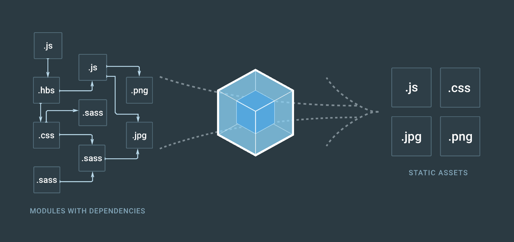

# Webpack Getting Started

> 今天学习了一下 Webpack ，只是入门，对其有了一个初步的概念，大致只是到官方文档的`概念`这里。这里将我所学习到的这一些皮毛做一个整理，以加深自己的理解，并帮助其他和我一样正在学习的同学。
> 前置知识
> 阅读时间

## 一、什么是 Webpack，用它来干嘛

每一个 Web App，即便是最简单的一个页面，也会使用一些其他资源，比如`*.js`，`*.css`等等。不使用 Webpack 前，我们只能自己手动在 `HTML` 页面里管理这些依赖，写一堆`<link ... />`, `<script src="..."></script>`，一个两个还好，但现代的 Web 每一个都有一大堆依赖，而且不光是数量的问题，资源有可能是多种类型的，有可能是`.js`或者`.ts`，可能是`.css`或者`.less`，这些文件还需要编译。如果这些资源用手动管理将是一场灾难，不仅重复简单低效的劳动，还容易出错，既然是程序员，那就应该尽可能将任务交给计算机自动处理。

Webpack 正是为此而生，作为一个*现代 JavaScript 应用程序的模块打包器(module bundler)*而存在。它将每一个资源文件都视为一个*模块(module)*，当 webpack 处理应用程序时，它会递归地*构建一个依赖关系图(dependency graph)*，其中包含应用程序需要的每个模块，然后将所有这些模块打包成少量的*捆包(bundle)*。bundle 通常只有一个，由浏览器加载。



这张从 [Webpack 官网](https://webpack.js.org)首页截取的图片基本可以直观地看出它是干啥的了。

*在模块打包这一基本功能的基础上，Webpack 还有很多令人欣喜的特性，但这不在本文的讨论范围，请参考官方文档。*

## 二、它是怎么工作的

Webpack 依照配置文件进行工作，文件名为`webpack.config.js`。在配置文件中，有四个 Webpack 的核心概念，如果不了解这些概念，就不能了解 Webpack。

### 1. 入口(Entry)

为了能够打包所有模块，Webpack 会构建一个依赖关系图，而这个图需要一个入口，来告诉 Webpack 从哪里开始构建。可以将它理解为运行 app 时第一个执行的文件。

```JavaScript
module.exports = {
    entry: './path/to/my/entry/file.js'
};
```

**入口可以有多个**

### 2. 出口(Output)

既然是打包，那把所有东西捆起来之后就会*生成(emit)*一个*捆包(bundle)*，这个就是出口。在配置文件中，出口需要两个属性，一个是路径，一个是文件名。

```JavaScript
const path = require('path');

module.exports = {
    entry: './path/to/my/entry/file.js', 
    output: {
        path: path.resolve(__dirname, 'dist'),  // 路径
        filename: 'my-webpack-output.bundle.js' // 文件名
    }
};
```

### 3. Loader

Webpack 的目标是将所有模块都打包起来，而使浏览器不必关注这些事情。这些模块包括但不限于`.js`, `.css`, `.sass`, `.png`, etc，但是 Webpack 只能理解 JavaScript 不能理解其他文件模块类型可咋办。上帝说要有光，于是便有了 Loader。它的作用就是把所有非 JavaScript 的模块转换成 Webpack 能够理解的模块。

不同类型的模块有不同的 Loader，比如`.css`可能会用到 `css-loader`，而`.txt`可能会用到`raw-loader`。

在配置文件中，对 Loader 需要配置两个必须的属性：
    1. 识别出是哪种文件（ `test` 属性）
    2. 对识别出的文件使用对应的 Loader 以转换它（ `use` 属性）

```JavaScript
const path = require('path');

const config = {
    entry: './path/to/my/entry/file.js', 
    output: {
        path: path.resolve(__dirname, 'dist'), 
        filename: 'my-webpack-output.bundle.js'
    }, 
    module: {   // Loader 模块转换
        rules: [ // test 和 use 要写在 rules 中，而 rules 要写在 module 中
            {
                test: /\.txt$/,     // test 属性，可以使用正则表达式
                use: 'raw-loader'   // .txt 文件对应的 Loader
            }
        ]
    }
};

module.exports = config;
```

Loader 通常是第三方的，要使用哪个必须先安装，比如上文中的 `raw-loader`：
```
npm install --save-dev raw-loader
```

**Loader 的特性**

- loader 支持链式传递。能够对资源使用流水线(pipeline)。loader 链式地按照先后顺序进行编译。loader 链中的第一个 loader 返回值给下一个 loader。在最后一个 loader，返回 webpack 所预期的 JavaScript。
- loader 可以是同步或异步函数。
- loader 运行在 Node.js 中，并且能够执行任何可能的操作。
- loader 接收查询参数。用于 loader 间传递配置。
- loader 也能够使用 options 对象进行配置。
- 除了使用 package.json 常见的 main 属性，还可以将普通的 npm 模块导出为 loader，做法是在 package.json 里定义一个 loader 字段。
- 插件(plugin)可以为 loader 带来更多特性。
- loader 能够产生额外的任意文件。

### 4. 插件(plugins)

Loader 通常只做转换，但有时候我们会需要进行一些更多的操作，最简单的比如添加一些注释信息，这时我们就可以使用插件，它可以完成 Loader 不能完成的任务。

Webpack 本身内置了一些插件，同时还可以安装第三方插件或自己写。使用 npm 进行安装。

```JavaScript
const HtmlWebpackPlugin = require('html-webpack-plugin'); //通过 npm 安装
const webpack = require('webpack'); //访问内置的插件
const path = require('path');

const config = {
  entry: './path/to/my/entry/file.js',
  output: {
    filename: 'my-first-webpack.bundle.js',
    path: path.resolve(__dirname, 'dist')
  },
  module: {
    rules: [
      {
        test: /\.(js|jsx)$/,
        use: 'babel-loader'
      }
    ]
  },
  plugins: [
    new webpack.optimize.UglifyJsPlugin(),	// 使用 Webpack 内置插件
    new HtmlWebpackPlugin({template: './src/index.html'})	// 使用第三方插件
  ]
};
// 以上插件功能请查阅相应文档

module.exports = config;
```

## 三、使用

### 1. 安装

Webpack 可以全局安装，也可以在项目内安装，推荐后者。
```
npm install --save-dev webpack     // 安装最新版
npm install --save-dev webpack@<version>    // 安装特定版本
```

### 2. 编写配置文件

配置文件名为 `webpack.config.js`，位于项目的根目录下。对于本 demo ，配置文件内容如下

```JavaScript
const webpack = require('webpack'); // webpack 内置插件
const path = require('path');       // 路径处理

module.exports = {
    entry: './entry.js',    // 入口
    output: {
        path: path.resolve(__dirname, 'dist'),  // 生成到当前目录的 dist 目录下
        filename: 'bundle.js'   // 生成文件名
    }, 
    module: {   // Loader 写在 module.rules 中
        rules: [
            {
                test: /\.css$/, 
                use: [
                    // 对一个模块可以使用多个 Loader ，顺序传递
                    { loader: 'style-loader' }, 
                    { loader: 'css-loader', 
                        option: {
                            modules: true
                        }
                    }
                ]
            }
        ]
    }
}
```

### 3. 打包

执行打包有多种方法，推荐使用在 `package.json` 中添加 `script` 字段实现，前提是你已经使用 npm 安装了 Webpack 。如下

```JavaScript
...
"script": {
    "build": "webpack"
}, 
...
```

然后在终端执行命令
```
npm run build
```

然后 Webpack 会输出打包过程的一些信息，执行完后会在我们指定的 `__dirname + dist` 目录下生成 bundle.js 文件。

原来我们的 HTML 文件结构是这样的：
```HTML
<!DOCTYPE html>
<html lang="zh-CN">
<head>
    <meta charset="utf-8">
    <title>Hello Webpack</title>
    <link href="./src/css/main.css" rel="stylesheet">
</head>
<body>
    <h1>Hello Webpack</h1>
    <script src="./src/js/main.js"></script>
</body>
</html>
```

现在我们只需要这样：
```HTML
<!DOCTYPE html>
<html lang="zh-CN">
<head>
    <meta charset="utf-8">
    <title>Hello Webpack</title>
</head>
<body>
    <h1>Hello Webpack</h1>
    <script src="dist/bundle.js"></script>
</body>
</html>
```

## 后记

本人也是初学，所以可能有错误疏漏，欢迎大家指正。

## 引用
 Webpack 中文官网(https://doc.webpack-china.org/concepts/)